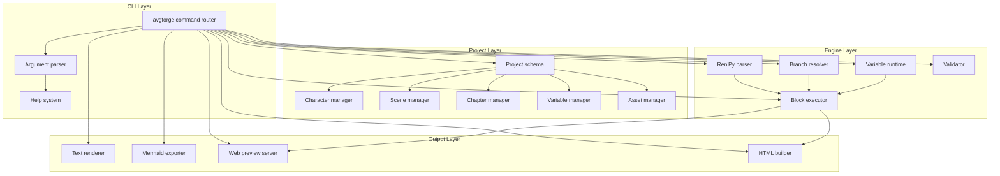

<div align="center">

# ⚒️ AVGForge

### Enterprise-Grade Visual Novel Authoring Pipeline

**Cross-platform CLI engine for professional interactive narrative content production**

[](LICENSE)
[](CHANGELOG.md)
[](#system-requirements)
[](https://www.python.org/)
[](.github/workflows/ci.yml)
[](docs/QUALITY.md)

</div>

---

## Overview

**AVGForge** is a headless, Git-native authoring pipeline for visual novel (VN) and interactive narrative content. Designed for studios that demand **deterministic builds**, **CI/CD integration**, and **reproducible artifact generation** without GUI dependency.

Unlike traditional VN editors that lock your workflow into a single desktop application, AVGForge treats your project as **structured data** — every asset, character, scene, and script block is a versioned, diffable JSON document. This enables team collaboration, automated testing, and pipeline integration impossible with GUI-only tools.

### Why AVGForge?

| Pain Point | Traditional Tools | AVGForge |
|---|---|---|
| Version control | Binary project files, no meaningful diffs | Plain JSON, Git-friendly, line-level diffs |
| CI/CD | Manual export required | `avgforge build` runs headless in any CI |
| Team collaboration | File lock conflicts | Branch, merge, resolve conflicts naturally |
| Automation | No scripting API | Full CLI + Python SDK |
| Reproducible builds | Environment-dependent | Deterministic, content-addressed output |
| Headless preview | Requires GUI | Web-based preview engine, browser-agnostic |

---

## Feature Matrix

### Core Authoring

| Feature | Status | Description |
|---|---|---|
| Project scaffolding | ✅ GA | `avgforge init` with blank/template presets |
| Character management | ✅ GA | Portraits, expressions, 5-position system, theme colors |
| Scene composition | ✅ GA | Multi-layer parallax backgrounds with depth distance |
| Chapter & fragment | ✅ GA | Hierarchical narrative structure with jump targets |
| Block-based scripting | ✅ GA | 25+ block types (dialogue, scene, camera, particle, branch...) |
| Variable system | ✅ GA | Boolean/Number/String × Project/System scope × Slot/Shared persistence |
| Branch & condition | ✅ GA | Choice jumps, conditional execution, fragment calls |
| Ren'Py-style editing | ✅ GA | Native syntax with `$EDITOR` integration |
| Asset management | ✅ GA | Import, reference tracking, unused asset detection |
| Project validation | ✅ GA | Reference integrity check, missing asset detection |

### Preview & Debug

| Feature | Status | Description |
|---|---|---|
| Text preview | ✅ GA | Terminal-rendered script flow with indentation |
| Mermaid flowchart | ✅ GA | Branch structure visualization |
| Web preview engine | ✅ GA | Browser-based runtime, full visual fidelity |
| OP timeline | 🔄 Beta | Operation-level execution trace |
| Variable inspector | 🔄 Beta | Runtime variable state inspection |
| Call stack | 📋 Planned | Fragment call chain analysis |

### Build & Distribution

| Feature | Status | Description |
|---|---|---|
| HTML single-file build | ✅ GA | Self-contained `.html` with embedded assets |
| Web bundle build | ✅ GA | Separated assets for CDN deployment |
| Project export | ✅ GA | Portable project archive |
| Desktop build (.app/.exe) | 📋 Planned | Electron-based native packaging |
| Mobile build | 📋 Research | React Native / Capacitor investigation |

### Enterprise Features

| Feature | Status | Description |
|---|---|---|
| Git-native format | ✅ GA | Every artifact is plain-text JSON |
| Deterministic builds | ✅ GA | Content-addressed, reproducible output |
| CI/CD pipeline | ✅ GA | Headless operation, exit-code semantics |
| Python SDK | ✅ GA | Programmatic project manipulation |
| Extension manifest | 🔄 Beta | Enable/disable extensions per-project |
| L10n framework | 📋 Planned | i18n string extraction & compilation |
| Analytics hooks | 📋 Planned | Custom event instrumentation |

---

## Architecture



### Design Principles

1. **Data over Code** — Project state lives in JSON, not in application memory
2. **Headless First** — Every operation works without a display server
3. **Git-Native** — Diff, merge, and branch your narrative like source code
4. **Deterministic** — Same input + same version = byte-identical output
5. **Extensible** — Plugin architecture for custom blocks and renderers

---

## Quick Start

### Installation

```bash
# Clone
git clone https://github.com/YOUR_USERNAME/avgforge.git
cd avgforge

# Install (no dependencies required)
chmod +x src/avgforge.py
ln -s $(pwd)/src/avgforge.py /usr/local/bin/avgforge

# Verify
avgforge --version
```

### Create Your First Project

```bash
# Scaffold a new project
avgforge init my-visual-novel --template blank

cd my-visual-novel

# Add a character
avgforge char add hoshino \
  --name "Hoshino" \
  --position right \
  --color "#ffb6d9"

avgforge char portrait add hoshino neutral \
  --file assets/characters/hoshino_neutral.png

# Add a scene
avgforge scene add classroom \
  --name "Classroom at Dusk" \
  --layer bg assets/backgrounds/classroom_bg.png --distance 10

# Edit script (opens $EDITOR with Ren'Py syntax)
avgforge edit prologue/main

# Preview in browser
avgforge preview web
# → Local server starts, browser opens automatically

# Build single-file HTML
avgforge build html --output dist/game.html
```

---

## Command Reference

```
avgforge <command> [subcommand] [options]

PROJECT
  init <name>              Create a new project
  info                     Show project metadata
  check                    Validate project integrity
  history                  Show snapshot history

CHARACTER
  char list                List all characters
  char add <id>            Add a character
  char edit <id>           Edit character properties
  char rm <id>             Remove a character
  char portrait add <id> <expr>  Add a portrait expression

SCENE
  scene list               List all scenes
  scene add <id>           Add a scene
  scene edit <id>          Edit scene layers
  scene rm <id>            Remove a scene

CHAPTER & FRAGMENT
  chapter list             List chapters
  chapter add <name>       Add a chapter
  chapter rm <name>        Remove a chapter
  frag list <chapter>      List fragments in a chapter
  frag add <chapter> <id>  Add a fragment

SCRIPT EDITING
  edit <chapter>/<frag>    Open Ren'Py-style editor ($EDITOR)
  block list <frag>        List blocks in a fragment
  block add <frag> <type>  Add a block
  block move <frag> <id>   Move a block
  block rm <frag> <id>     Remove a block

VARIABLE
  var list                 List all variables
  var add <key>            Add a variable
  var edit <key>           Edit a variable
  var rm <key>             Remove a variable

ASSET
  asset list               List all assets
  asset import <file>      Import an asset
  asset refs <file>        Show references to an asset
  asset unused             List unused assets

PREVIEW
  preview text [chapter]   Text-based script preview
  preview graph            Mermaid flowchart export
  preview web              Web-based visual preview (browser)

BUILD
  build html               Single-file HTML build
  build web                Web bundle (separated assets)
  build export             Portable project archive
```

---

## Project Structure

```
my-visual-novel/
├── project.json              # Project configuration
├── project.variables.json    # Variable definitions
├── characters.json           # Character roster
├── scenes.json               # Scene compositions
├── chapters/
│   ├── start.json            # Entry chapter (required)
│   ├── prologue.json
│   └── chapter_01.json
├── assets/
│   ├── backgrounds/
│   ├── characters/
│   ├── bgm/
│   ├── se/
│   ├── voice/
│   └── video/
├── config/
│   └── personalization/
└── .avgforge/                # Internal state (git-ignored)
    ├── cache/
    └── snapshots/
```

All files are **plain JSON** — fully diffable, mergeable, and version-controllable.

---

## System Requirements

| Requirement | Minimum | Recommended |
|---|---|---|
| OS | Linux x64 / macOS 11+ / Windows 10+ | Any modern OS |
| Python | 3.9+ | 3.11+ |
| RAM | 512 MB | 2 GB+ for large projects |
| Disk | 100 MB (tool) + project assets | SSD recommended |
| Browser | Any modern browser (for web preview) | Chrome / Firefox / Safari latest |

**Zero runtime dependencies** — pure Python standard library.

---

## Licensing

AVGForge uses a **dual-license model** to support both open-source communities and commercial use cases:

### 1. AGPL-3.0 (Open Source)

For open-source projects, educational use, personal projects, and evaluation, AVGForge is licensed under the [GNU Affero General Public License v3.0](LICENSE-AGPL).

**Key obligations:**
- Source code of modifications must be disclosed
- Network use constitutes distribution (AGPL clause)
- License notices and copyright must be preserved

### 2. Commercial License

For proprietary projects, commercial products, SaaS integration, or use cases incompatible with AGPL-3.0, a commercial license is available.

**Commercial license benefits:**
- No AGPL copyleft obligation
- No source disclosure requirement
- Priority technical support
- Custom feature development
- Indemnification against IP claims

**Contact:** `commercial@avgforge.example` for licensing inquiries.

### License Decision Guide

| Use Case | Recommended License |
|---|---|
| Personal / hobby project | AGPL-3.0 |
| Open-source project (AGPL-compatible) | AGPL-3.0 |
| Open-source project (non-AGPL) | Commercial |
| Commercial / proprietary product | Commercial |
| SaaS / hosted service | Commercial |
| Educational / academic | AGPL-3.0 |
| Internal enterprise tool | Commercial |

See [LICENSE](LICENSE) for the full dual-license declaration.

---

## Roadmap

### v1.0 (Current — Enterprise GA)
- ✅ Core CLI with 20+ commands
- ✅ Full project schema (characters, scenes, chapters, fragments, blocks, variables)
- ✅ Ren'Py-style script editor
- ✅ Web preview engine
- ✅ HTML single-file build
- ✅ Project validation and integrity check
- ✅ Git-native JSON format

### v1.1 (Q2 2026)
- 🔄 OP timeline debugger
- 🔄 Variable inspector
- 🔄 Call stack analysis
- 🔄 Extension manifest management

### v1.2 (Q3 2026)
- 📋 Desktop build (.app / .exe via Electron)
- 📋 L10n framework (i18n string extraction)
- 📋 Analytics hooks
- 📋 Cloud sync protocol

### v2.0 (Q4 2026)
- 📋 Extension SDK (TypeScript + React)
- 📋 Visual scene editor (web-based)
- 📋 Multi-user collaboration protocol
- 📋 Mobile build (React Native / Capacitor)

---

## Enterprise Support

For enterprise customers, we provide:

- **Priority SLA** — 24/7 critical issue response
- **Custom feature development** — Tailored blocks, renderers, integrations
- **On-premise deployment** — Air-gapped installation support
- **Training & onboarding** — Team workshops and best practices
- **Audit & compliance** — SOC2 / ISO27001 documentation packages

**Contact:** `enterprise@avgforge.example`

---

## Contributing

We welcome contributions from the community. Please read our [Contributing Guide](CONTRIBUTING.md) before submitting pull requests.

### Contributors

<div align="center">

Made with ⚒️ by the AVGForge team

</div>

---

## Security

Found a security vulnerability? Please review our [Security Policy](SECURITY.md) and report responsibly.

---

## Acknowledgments

AVGForge draws architectural inspiration from industry-standard visual novel engines and modern CLI tooling. We thank the open-source community for their foundational work.

- Project format compatible with [LetsGal Studio](https://avg-engine.com/) project files
- Ren'Py syntax inspired by [Ren'Py Visual Novel Engine](https://www.renpy.org/)
- Web preview engine built on standard Web APIs

---

<div align="center">

**Documentation:** [docs.avgforge.example](https://github.com/YOUR_USERNAME/avgforge/tree/main/docs) · **Changelog:** [CHANGELOG.md](CHANGELOG.md) · **License:** [Dual AGPL + Commercial](LICENSE)

</div>
